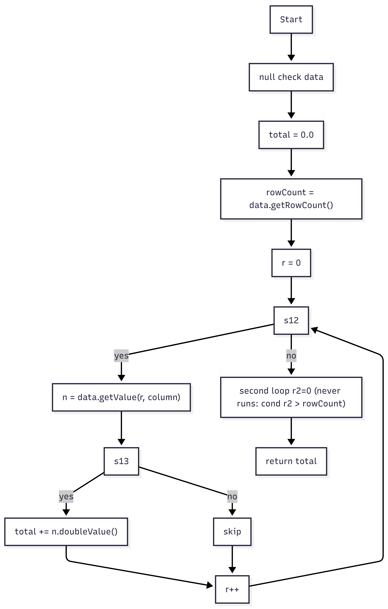
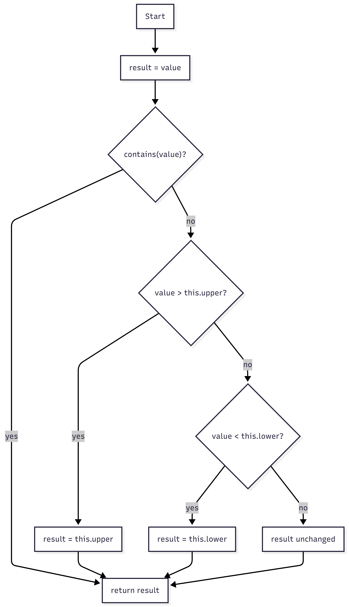
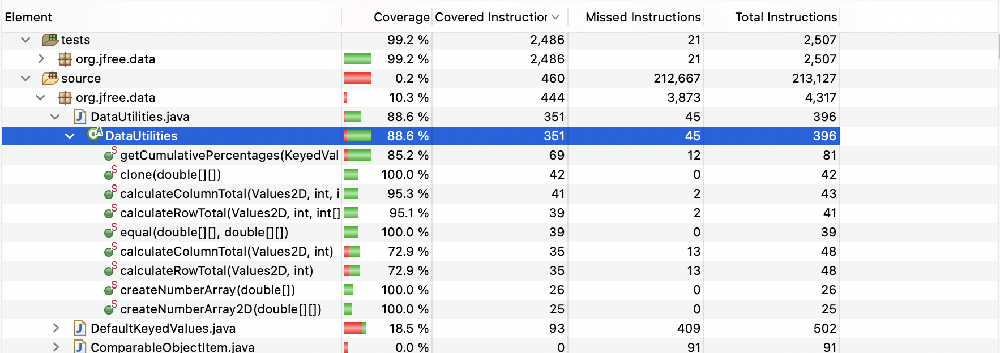
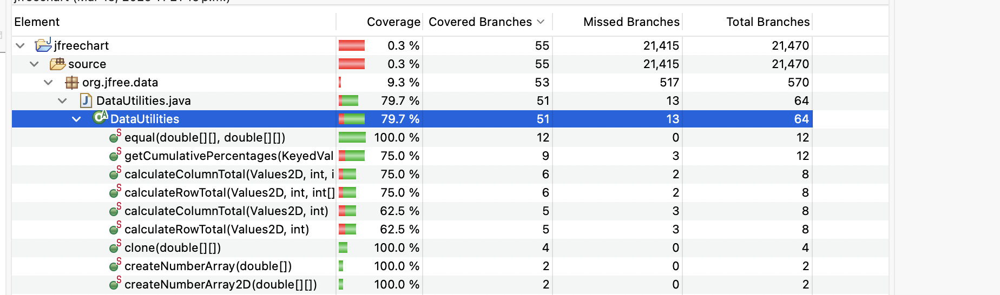
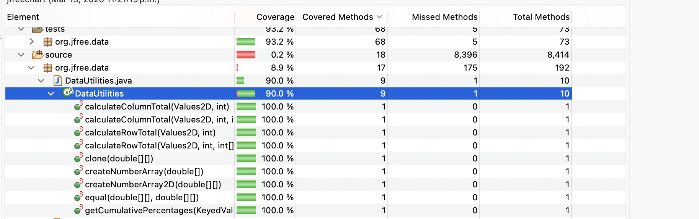
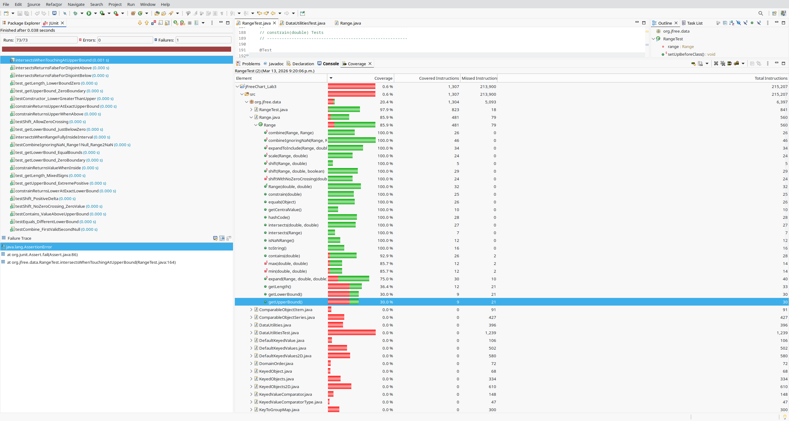
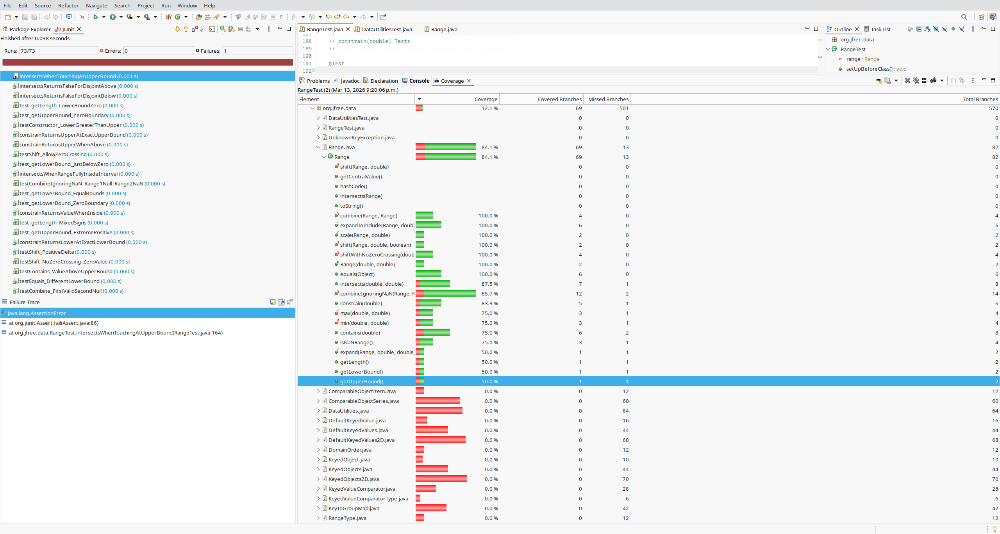
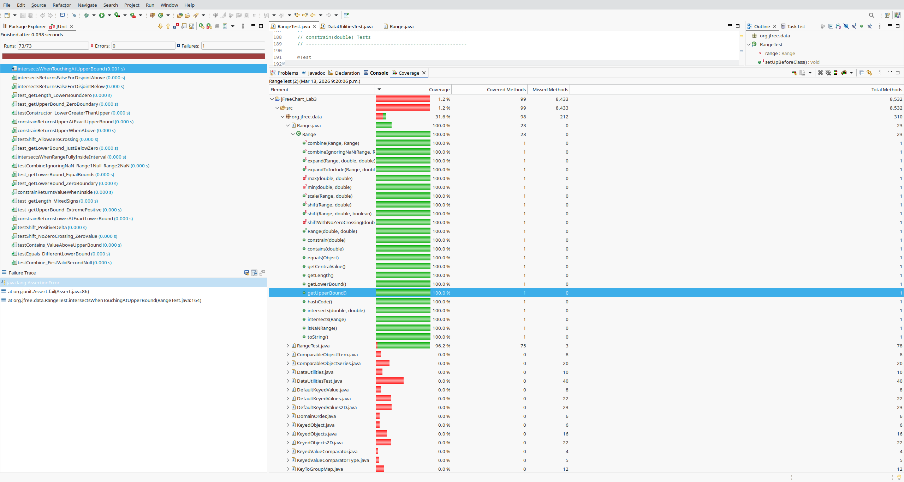

**SENG 637 - Dependability and Reliability of Software Systems**

**Lab. Report #3 – Code Coverage, Adequacy Criteria and Test Case Correlation**

| Group \#:      |   1  |
| -------------- | --- |
| Student Names: | Ucid    |
|    Noshin            |  30112985   |
|          Ashwin      |   30300738  |
|      Jasneet          |  30044332   |
|Salehin                | 30270206    |

# 1 Introduction

This assignment focuses on white-box testing and evaluating the adequacy of our unit test suites using code coverage metrics. Building upon the black-box testing suite created in Assignment 2, we used code coverage tools to measure the percentage of the code exercised by our initial tests. We then actively designed new test cases targeting unexecuted branches and statements to improve our coverage for the org.jfree.data.DataUtilities and org.jfree.data.Range classes. This lab provided hands-on experience with control-flow coverage, dealing with infeasible paths, and understanding the trade-offs between coverage-based and requirements-based test generation.

# 2 Manual data-flow coverage calculations for X and Y methods

- Methods analyzed: DataUtilities.calculateColumnTotal and Range.constrain.
- Flowcharts: see Appendix A (images calculateColumnTotal.png, contains.png).
- DU tables and test coverage mappings: see Appendix B.

# Appendix A: Data-flow Graphs

### **DataUtilities.calculateColumnTotal**  

### **Range.constrain(double value)**  

# Appendix B: Data Flow Tables (Part B)

### DataUtilities.calculateColumnTotal DU-pairs coverage

| Var    | DU-pairs (def -> use) | Reachable? |
|--------|-----------------------|------------|
| data   | getRowCount(); getValue(r,col) | Yes |
| column | getValue(r,col) | Yes |
| total  | total=0 -> total += ... -> return | Yes |
| rowCount | r < rowCount | Yes |
| r      | init/incr -> guard; -> getValue | Yes |
| r2     | init/incr -> guard; -> getValue | No (dead) |
| n      | def -> (n!=null); def -> n.doubleValue() | Yes |

**Test coverage (2-arg overload)**

| Test (class)                                   | Non-null add | Null skip | Multi-row sum | Empty table | Notes |
|------------------------------------------------|--------------|-----------|---------------|-------------|-------|
| calculateColumnTotalForSingleRow (DataUtilitiesTest) | Yes | No | No | No | single value |
| calculateColumnTotalForTwoValues (DataUtilitiesTest) | Yes | No | Yes | No | sums 2 rows |
| calculateColumnTotalForNegativeValues (DataUtilitiesTest) | Yes | No | Yes | No | negative values |
| calculateColumnTotalForLargeNumbers (DataUtilitiesTest) | Yes | No | Yes | No | large doubles |
| columnTotalMultipleRowsAddsAll (DataUtilitiesTest) | Yes | No | Yes | No | 3 rows |
| columnTotalSkipsNulls (DataUtilitiesTest) | Yes | Yes | Yes | No | mixes null/non-null |
| calculateColumnTotalForEmptyTableIsZero (DataUtilitiesTest) | No | No | No | Yes | rowCount=0 |

**Test coverage (3-arg overload)**

| Test (class)                                            | Valid rows in-bounds | Out-of-bounds skipped | Empty valid[] | Negative index ignored | Duplicates counted |
|---------------------------------------------------------|----------------------|-----------------------|---------------|------------------------|--------------------|
| columnTotalWithValidRowsFiltersRows (DataUtilitiesExtraTest) | Yes | No | No | No | No |
| columnTotalWithValidRowsSkipsOutOfBounds (DataUtilitiesExtraTest) | No | Yes | No | No | No |
| columnTotalWithValidRowsEmptyArrayReturnsZero (DataUtilitiesExtraTest) | No | No | Yes | No | No |
| columnTotalWithValidRowsIgnoresNegativeIndices (DataUtilitiesExtraTest) | No | No | No | Yes | No |
| columnTotalWithValidRowsCountsDuplicates (DataUtilitiesExtraTest) | No | No | No | No | Yes |

### Range.constrain  path coverage

| Test (RangeExtraTest) | contains? | value > upper? | value < lower? | result source | Notes |
|-----------------------|-----------|----------------|----------------|---------------|-------|
| constrainInsideReturnsSame | Yes | No | No | value | inside bounds |
| constrainBelowClampsToLower | No | No | Yes | lower | clamps low |
| constrainAboveClampsToUpper | No | Yes | No | upper | clamps high |
| constrainNaNReturnsNaN | No | No | No | value | NaN passes through |
| constrainWithInfiniteBoundsPassesThrough | Yes | No | No | value | unbounded range |

# 3 A detailed description of the testing strategy for the new unit test

Our testing strategy was led by the analyzing the control flow metrics obtained from our baseline Assignment 2 test suite.

1. We first ran our existing test suite using the EclEmma coverage tool in Eclipse.
- For statement coverage we used the default Instruction Coverage. Since instruction coverage measures the execution of the Java bytecode, it serves as a direct proxy for testing if source code statements (lines) are executed.
- EclEmma does not support condition coverage, so as per instructions we substituted it with method coverage.

2. Since EclEmma does not natively report condition coverage, we substituted it with method coverage, as permitted by lab instructions.

3. We analyzed the visual red/green highlights to identify unexecuted branches, instructions, and methods.

4. While we inspected the source code to find any paths not covered, we based our test oracles from the Javadoc requirements.

5. We also discovered paths that were impossible to reach. Such as the Range methods getLowerBound(), getUpperBound(), getLength() check if (lower > upper) and throw an exception. Yet the Range constructor already checks this condition and prevents instantiation if lower > upper. This is an example of an infesible path, which justifies why 100% statement coverage cannot be achieved for these methods.

# 4 A high level description of five selected test cases you have designed using coverage information, and how they have increased code coverage

## DataUtilitiesTest

1. cloneNullSourceThrowsIllegalArgumentException()
This test checks that the clone(double[][]) method properly rejects a null input by throwing an IllegalArgumentException. Its coverage impact is important because it exercises the defensive error handling path instead of the normal cloning path. Without this test, only valid input behavior would be covered, so the exception branch would remain untested.

2. columnTotalSkipsNulls()
This test verifies that calculateColumnTotal(Values2D, int) ignores null values instead of trying to add them. It improves coverage by forcing the condition that checks whether a value is null to evaluate false for at least one iteration. Most normal test cases only cover non null values, so this case adds branch and condition coverage while also confirming that null entries do not affect the total.

3. columnTotalWithValidRowsSkipsOutOfBounds()
This test uses a filtered row array that contains one valid row index and one invalid row index. It checks that the method includes the valid row in the total and skips the out of bounds row safely. This increases branch coverage because it exercises both outcomes of the row bounds check, which would not happen if all indices were valid.

4. rowTotalWithValidColsSkipsOutOfBounds()
This test does the same kind of check for calculateRowTotal(Values2D, int, int[]), but on columns instead of rows. It confirms that valid columns are counted and invalid columns are ignored. Its main coverage contribution is that it executes both sides of the column bounds decision, which strengthens branch and condition coverage for the filtered row total method.

5. cumulativePercentagesHandlesNullsAsZero()
This test verifies that getCumulativePercentages(KeyedValues) handles a null value correctly by treating it as contributing nothing to the running total. It improves coverage by exercising the null handling condition inside the cumulative calculation logic. It also strengthens the quality of the test suite because it checks both control flow and correctness of the resulting percentages.

## RangeTest

1. testContains_ValueBelowLowerBound()
Description: Verifies that passing a value strictly below the range's lower boundary returns false.
Design: Targeted the boundary check false condition within the contains(double) method.
Impact: Increased branch and statement coverage for the lower-bound failure path.
2. testCombine_BothNull()
Description: Verifies that combining two null ranges returns null.
Design: Executes the previously unvisited sequential null-check decisions at method start.
Impact: Coverage increase for the initial conditional branches in the combine method.
3. testExpandToInclude_NullRange()
Description: Verifies expanding a null range creates a new range using the provided value.
Design: Targets the expandToInclude method which was completely missed by baseline tests.
Impact: Satisfies the null-guard check and early return logic.
4. testExpandToInclude_ValueAlreadyInside()
Description: Verifies that internal values return the original range unaltered.
Design: Targets the final default return statement when no expansion is needed.
Impact: Reaches the default state by bypassing both upper and lower expansion branches.
5. testEquals_DifferentClass()
Description: Verifies that comparing Range to a non-Range object correctly returns false.
Design: Targets the type-checking safety guard instanceof in the equals method.
Impact: Exercises the early return false block for invalid type comparisons.

# 5 A detailed report of the coverage achieved of each class and method (a screen shot from the code cover results in green and red color would suffice)

1. Data Utilities Class Coverage Achieved:
Instruction Coverage: 88.6%
Branch Coverage: 79.7%
Method Coverage: 90.0%

## DataUtilities Instruction Coverage

## DataUtilities Branch Coverage

## DataUtilities Method Coverage

2. Range Class Coverage Achieved:
Instruction Coverage: 85.9%
Branch Coverage: 84.1%
Method Coverage: 100%

## Range Instruction Coverage

## Range Branch Coverage

## Range Method Coverage

# 6 Pros and Cons of coverage tools used and Metrics you report

Tool Used: EclEmma

Pros:
- Ease of installation, and works seamlessly with Eclipse. We could simply run it by using "Coverage As -> JUnit Test".
- The red/green highliting made identifying missed branches easy and simple.

Cons:
- The default view only shows instruction coverage. We had to configure the Active Counters to observe method and branch metrics.
- It does not support condition coverage which required us to substitute it with method coverage.

# 7 A comparison on the advantages and disadvantages of requirements-based test generation and coverage-based test generation.

1. Requirements based testing
- Advantages: It tests the SUT against specifications, validating it against functional specifications to confirm that the final product meets requirements. It encourages testers to prioritize end user behaviours and edge cases defined by the domain.
- Disadvantages: It does not guarantee complete code coverage. Internal logic, hidden architectural errors or defensive programming can remain unexecuted if not triggered by public interfaces defined in the requirements.

2. Coverage based testing
- Advantages: It ensures that the internal implementation is rigorously verified. It is effective in identifying unreachable code, ensuring exhaustive switch statement logic and confirming all control flow edges interact properly.
- Disadvantages: Pursuing 100% coverage is impractical because of the high density of infeasible execution paths. Also, high coverage metrics only show that the code is executable; it does not ensure that software logic is satisfactory according to the often broader business objectives. 

# 8 A discussion on how the team work/effort was divided and managed

The work for this assignment was divided among the team members to ensure efficient collaboration and balanced contributions. **Ashwin** was responsible for setting up the runnable project environment, executing the code coverage analysis using EclEmma, and collecting the coverage screenshots and tool documentation. **Salehin** completed the manual data-flow analysis, including constructing the two data-flow graphs, generating the definition–use (DU) tables, and preparing the coverage-per-test table. **Noshin** focused on implementing and documenting the test cases for the DataUtilities class, including commenting the test code and identifying five key test cases used to improve coverage. **Jasneet** developed the test cases for the Range class and compiled the final report, including consolidating contributions from all team members, polishing the document, and handling the final submission. This division of tasks allowed the team to work in parallel on different components of the assignment while coordinating progress through regular communication.

# 9 Any difficulties encountered, challenges overcome, and lessons learned from performing the lab

A major difficulty we encountered was in handling EclEmma's limitation with condition coverage. Since the tool did not show it, we had to check the assignment rules and pivot to using Method coverage as an alternative.

Another challenge was understanding why certain methods capped out around 30-60% coverage. Through team analysis we identified cases of infeasible paths. We got to learn that certain programming inside a method could be unreacheable if the constructor already checks the condition. This was a great moment to learn that 100% coverage is often unrealistic.

# 10 Comments/feedback on the lab itself

This lab provided a practical introduction to evaluating test suite adequacy using code coverage techniques. It helped reinforce concepts from unit testing by showing how coverage metrics such as instruction or branch coverage can be used to identify untested parts of the code. The use of tools like EclEmma allowed us to visualize which parts of the source code were exercised by our tests, making it easier to design additional test cases. One challenge encountered during the lab was understanding the differences between the coverage metrics reported by the tool and those suggested in the assignment instructions. Overall, the lab was valuable in demonstrating the relationship between test design and coverage measurement, and it highlighted the limitations of relying solely on coverage metrics to assess test quality.
